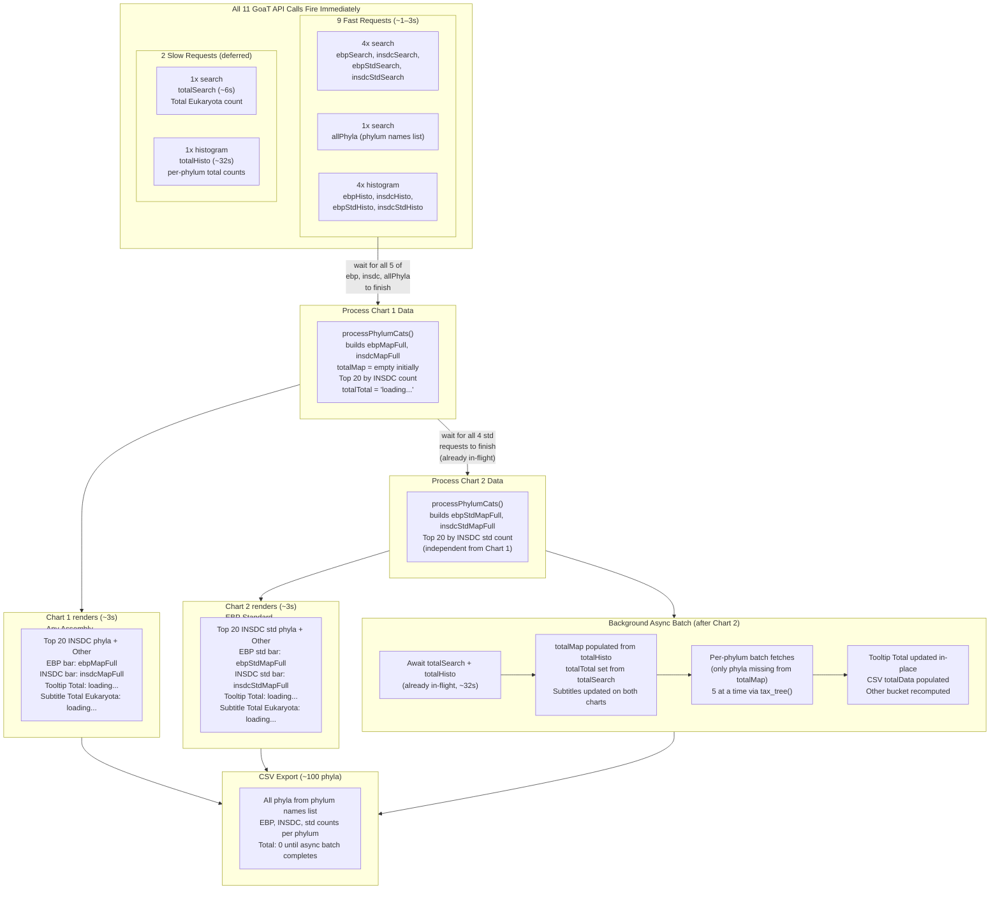

```mermaid
flowchart TD
    subgraph FIRE["All 11 GoaT API Calls Fire Immediately"]
        direction LR
        subgraph FAST["9 Fast Requests (~1–3s)"]
            S1["4x search\nebpSearch, insdcSearch,\nebpStdSearch, insdcStdSearch"]
            S2["1x search\nallPhyla (phylum names list)"]
            H1["4x histogram\nebpHisto, insdcHisto,\nebpStdHisto, insdcStdHisto"]
        end
        subgraph SLOW["2 Slow Requests (deferred)"]
            S3["1x search\ntotalSearch (~6s)\nTotal Eukaryota count"]
            H2["1x histogram\ntotalHisto (~32s)\nper-phylum total counts"]
        end
    end

    FAST -->|"wait for all 5 of\nebp, insdc, allPhyla\nto finish"| PROC1

    subgraph PROC1["Process Chart 1 Data"]
        P1["processPhylumCats()\nbuilds ebpMapFull, insdcMapFull\ntotalMap = empty initially\nTop 20 by INSDC count\ntotalTotal = 'loading...'"]
    end

    PROC1 --> CHART1

    subgraph CHART1["Chart 1 renders (~3s)\nAny Assembly"]
        C1["Top 20 INSDC phyla + Other\nEBP bar: ebpMapFull\nINSDC bar: insdcMapFull\nTooltip Total: loading...\nSubtitle Total Eukaryota: loading..."]
    end

    PROC1 -->|"wait for all 4 std\nrequests to finish\n(already in-flight)"| PROC2

    subgraph PROC2["Process Chart 2 Data"]
        P2["processPhylumCats()\nbuilds ebpStdMapFull, insdcStdMapFull\nTop 20 by INSDC std count\n(independent from Chart 1)"]
    end

    PROC2 --> CHART2

    subgraph CHART2["Chart 2 renders (~3s)\nEBP Standard"]
        C2["Top 20 INSDC std phyla + Other\nEBP std bar: ebpStdMapFull\nINSDC std bar: insdcStdMapFull\nTooltip Total: loading...\nSubtitle Total Eukaryota: loading..."]
    end

    PROC2 --> ASYNC

    subgraph ASYNC["Background Async Batch (after Chart 2)"]
        A1["Await totalSearch + totalHisto\n(already in-flight, ~32s)"]
        A2["totalMap populated from totalHisto\ntotalTotal set from totalSearch\nSubtitles updated on both charts"]
        A3["Per-phylum batch fetches\n(only phyla missing from totalMap)\n5 at a time via tax_tree()"]
        A4["Tooltip Total updated in-place\nCSV totalData populated\nOther bucket recomputed"]
        A1 --> A2 --> A3 --> A4
    end

    subgraph CSV["CSV Export (~100 phyla)"]
        E["All phyla from phylum names list\nEBP, INSDC, std counts per phylum\nTotal: 0 until async batch completes"]
    end

    CHART1 & CHART2 --> CSV
    ASYNC --> CSV
```
