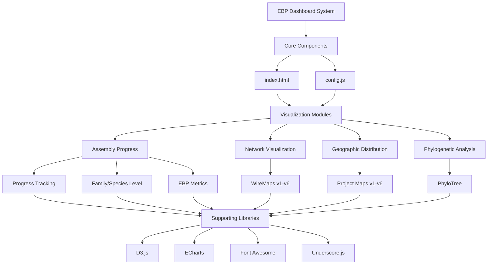

# EBP Dashboard System Architecture

## System Overview

The EBP Dashboard is a comprehensive visualization system for tracking and displaying Earth BioGenome Project data. Below is the system architecture diagram:

## Component Details

### Core Components
- **index.html**: Main entry point and dashboard interface
- **config.js**: Configuration and metadata management

### Visualization Modules
1. **Assembly Progress**
   - Progress tracking at taxonomic levels
   - Family and species level analysis
   - EBP metrics compliance tracking

2. **Network Visualization**
   - WireMaps showing EBP and affiliate networks
   - Multiple versions with iterative improvements

3. **Geographic Distribution**
   - Interactive project location maps
   - Enhanced visualization features

4. **Phylogenetic Analysis**
   - Taxonomic relationship trees
   - Order-level phylogenetic analysis

### Supporting Libraries
- D3.js: Core visualization engine
- ECharts: Advanced charting capabilities
- Font Awesome: Icon system
- Underscore.js: Utility functions

## Data Organization
- Source files in `source files/` directory
- Individual visualization HTML files
- Common utilities in `utils.js`
- Geographic data in `world.js`

## Architecture Features
- Modular design with self-contained visualization components
- Configuration-driven interface
- Modern web technologies
- Scalable visualization framework 